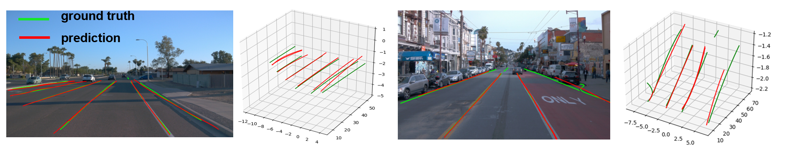

# Monocular 3D Lane Detection with Pose Estimation
<p align="center" width="100%">
    
</p>

## Quick Navigation
- [Installation](#installation)
- [Dataset](#dataset)
- [Code](#code)
  - [Train](#train)
  - [Predict](#predict)
  - [Evaluate](#evaluate)


## Project Description
This repo contains the source code for the semester project Monocular 3D lane detection @ [Vita EPFL](https://www.epfl.ch/labs/vita/).

## Installation
### 1. Clone this repository
``` bash
git clone https://github.com/Ivonne320/3D_LaneDetection_with_Pose_Estimation.git
```

### 2. Install OpenPifPaf
This will also install all the required dependencies for 2D lane detection part. We recommend doing this in a virtual environment like Anaconda. 
``` bash
pip3 install openpifpaf
```
The required files to register our dataset as a plugin is contained in the folder `openpifpaf_openlane`. (IMPORTANT: Do not change the name of this folder as OpenPifPaf requires this naming convention to recognise the plugin.)

### 3. Download checkpoint (optional)
A [checkpoint](https://drive.google.com/file/d/16RwIHEp8VzhydVFQOrDUeawPD3_K_uYa/view?usp=sharing) for 2D keypoint lane detection trained on 25% of OpenLane training set for 300 epochs is provided, as well as [our finetuned ZoeDepth model](https://drive.google.com/file/d/19675PHPn1B4B0fPbu4cwHpAmkDcAvKiN/view?usp=sharing) on OpenLane (for only 600 OpenLane images). 

## Dataset
The dataset that we work with is [OpenLane](https://github.com/OpenDriveLab/OpenLane).

To prepare the dataset for training, you may follow the steps below.

### 1. Download OpenLane

Follow the [download instructions](https://github.com/OpenDriveLab/OpenLane/tree/main#download) given by OpenLane.

### 2. Organise folder structure

Organise the folder structure as follows:
```
├── images        #to be known as IMAGE_DIR
|   ├── training
|   |   ├── segment-xxx
|   |   |   ├── xxx.jpg
|   |   |   └── ...
|   └── validation
|       ├── segment-xxx
|       |   ├── xxx.jpg
|       |   └── ...
├── annotations    #to be known as ANN_DIR
|   ├── training
|   |   ├── segment-xxx
|   |   |   ├── xxx.json
|   |   |   └── ...
|   ├── validation
|   |   ├── segment-xxx
|   |   |   ├── xxx.json
|   |   |   └── ...
|   └── test
|       ├── curve_case
|       |   ├── segment-xxx
|       |   |   ├── xxx.json
|       |   |   └── ...
|       ├── ...
|       ├── curve_case.txt
|       ├── xxx.txt

```

This is important to ensure that the folder structure is compatible with our preprocessing code.

### 3. Preprocess dataset
`openpifpaf_openlane/openlane_to_coco.py` will take all the 2D lane annotations, downsample them to 24 points, calculate a bounding box that contains all 24 points, and combine the information into a single `.json` file following the annotation style of the COCO dataset. 

To use the script, simply replace the file paths as needed and run the following command:

```bash
python3 -m openpifpaf_openlane.openlane_to_coco \
    --dir_data= ANN_DIR \
    --dir_images= IMAGE_DIR \
    --dir_out= OUTPUT_DIR \
    --sample
```

This will produce two big `.json` files, one containing annotations for training and one for validation.
As the original number of annotations is huge and will require a lot of computation for training, we have chosen to keep just 10% of the annotations by providing the `--sample` argument. You may choose to omit this argument if you have the computational means. 

## Code

### Train 

For training on OpenLane dataset, you can run `./train_job.sh` after proper modifications to the `train_2-lr-0001.bat` parameters and directories. Note that our bash script is written with the intention to submit a batch job to HPC resources like SCITAS. If you do not require this, do alter the commands as you deem fit. 

You may also simply run the following code on the command line, with modification to parameters you would like to tune and experiment with.

```
python3 -m openpifpaf.train --lr=0.002 --momentum=0.9 --b-scale=5.0 \
  --epochs=1000 \
  --lr-warm-up-factor=0.25 \
  --output=outputs/openlane_train \
  --batch-size=5  --val-batches=1 --val-interval=10 \
  --weight-decay=1e-5 \
  --dataset=openlane \
  --basenet=shufflenetv2k16 \
  --openlane-train-annotations <dir of training annotations>
  --openlane-val-annotations <dir of validation annotations> \
  --openlane-train-image-dir <dir of training images> \
  --openlane-val-image-dir <dir of validation images>\
  --loader-workers 1
```
For finetuning the ZoeDepth model, please clone their repo:
```
git clone https://github.com/isl-org/ZoeDepth.git
```
Prepare the environment as their instruction. We recommend to use a separate virtual environment. And then, replace the corresponding files as we provide in `others/zoedepth/replacement`. The grount truth depth maps for fine-tuning could be generated using `others/zoedepth/utils/batch_gen_depth.py`. Then the ZoeDepth_nk model could be fine-tuned with `train_mix.py`

### Predict

2D lane prediction runs using the standard openpifpaf predict command, but using the model we have trained specifically on lanes. The command line argument is as follows:

 ```
 python3 -m openpifpaf.predict  \
         --checkpoint <specify the checkpoint path> \ 
         --force-complete-pose --debug-indices cif:0 caf:0 \
         --long-edge=425 --loader-workers=1 \ 
         --save-all # save every debug plot
         --image-output <optionally specify output dir and file name> \
         <path of the image you want to perform prediction on>  
```
You can also decide whether to output a json file, with the option to specify the output path or directory (default: None) using `--json-output`.
In addition, you can also decide whether you want to interactively show the plots in matplotlib with `--show` (use itermplot, for instance)
or to save image files with `--save-all` (defaults to the all-images/ directory). 

The necessary scripts are already in `predict.sh`, you can simply run `./predict.sh` after modifications.

For 3D prediction, a script is provided for retrieving 3D information from ZoeDepth predicted depth map and visualize the 3D lanes using OpenLane prediction `utils/3d_reconstruction_for_demo.ipynb`

### Evaluate

To evaluate the 2D or 3D prediction, please use the tools provided in `eval_lane`, and for detailed instruction, please refer to [OpenLane](https://github.com/OpenDriveLab/OpenLane). We also provide script for preparing the result jsons and test list in `others/openlane`.

